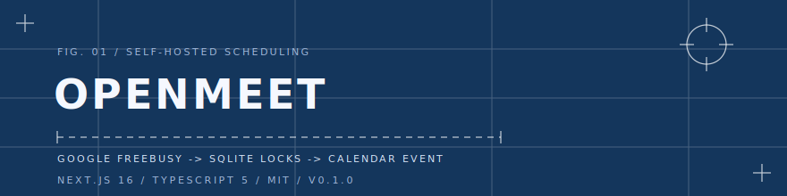
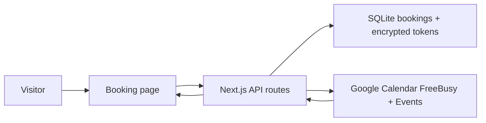

<div align="center">



# OpenMeet

One shareable booking page. One Google Calendar owner. No team scheduler, account system, or calendar mirror.

<p>
  <a href="https://github.com/LaughingisLaughing/openmeet/actions/workflows/ci.yml"></a>
  <a href="https://github.com/LaughingisLaughing/openmeet/actions/workflows/secret-scan.yml"></a>
  <a href="https://github.com/LaughingisLaughing/openmeet/releases/tag/v0.1.0"></a>
  <a href="LICENSE"></a>
</p>

<p>
  
  
  
  
</p>

<a href="https://github.com/LaughingisLaughing/openmeet">
  
</a>

</div>

---

## The Problem

You want to share a booking link, but most schedulers start by turning a simple personal workflow into a SaaS account, a team scheduling model, or a calendar sync surface you do not need.

OpenMeet keeps the surface small: a public booking page, a private owner admin flow, Google Calendar availability, and local SQLite locks.

## The Fix

Visitors pick an available slot. The app checks Google Calendar FreeBusy, applies local booking locks, creates a Google Calendar event, and stores only the local booking state plus encrypted owner OAuth tokens.



## Quick Start

OpenMeet is an app, not a published npm package. Run it from the GitHub source:

```bash
git clone https://github.com/LaughingisLaughing/openmeet.git
cd openmeet
npm install
cp env.example .env
npm run gen:key
npm run dev
```

Paste the generated key into `TOKEN_ENCRYPTION_KEY`, then set:

- `OWNER_EMAIL`
- `OWNER_NAME`
- `GOOGLE_CLIENT_ID`
- `GOOGLE_CLIENT_SECRET`
- `ADMIN_SECRET`

Create a Google OAuth 2.0 Web application with this authorized redirect URI:

```text
http://localhost:3000/api/admin/google/callback
```

Enable the Google Calendar API for the same Google Cloud project. Then open `http://localhost:3000/admin`, enter `ADMIN_SECRET`, and complete the owner OAuth flow.

## What It Does

| Capability | How it works |
| --- | --- |
| Public booking page | Calendar-style date picker and available time list |
| Availability checks | Google Calendar FreeBusy plus local pending and confirmed bookings |
| Event creation | Google Calendar event insert with the invitee as an attendee |
| Token storage | Owner OAuth tokens encrypted at rest with `TOKEN_ENCRYPTION_KEY` |
| Cancellation | Tokenized cancellation link backed by local booking state |

## Commands

| Command | Purpose |
| --- | --- |
| `npm run dev` | Start the local development server |
| `npm run build` | Build the production app |
| `npm run start` | Start the production server after a build |
| `npm run typecheck` | Run TypeScript without emitting files |
| `npm run gen:key` | Generate a 32-byte base64 token encryption key |

## Configuration

| Variable | Required | Description |
| --- | --- | --- |
| `APP_BASE_URL` | Yes | Public URL for callbacks and cancel links. |
| `OWNER_EMAIL` | Yes | Google account email expected during OAuth. |
| `OWNER_NAME` | No | Display name on the booking page. |
| `OWNER_TIME_ZONE` | Yes | IANA timezone used to generate availability. |
| `GOOGLE_CALENDAR_ID` | No | Calendar ID. Use `primary` for the authenticated primary calendar. |
| `GOOGLE_CLIENT_ID` | Yes | OAuth web client ID from Google Cloud. |
| `GOOGLE_CLIENT_SECRET` | Yes | OAuth web client secret from Google Cloud. |
| `TOKEN_ENCRYPTION_KEY` | Yes | 32-byte base64 key from `npm run gen:key`. |
| `ADMIN_SECRET` | Yes | Shared secret for `/admin` Google connection. |
| `EVENT_DURATION_MINUTES` | No | Meeting length. Defaults to `30`. |
| `SLOT_STEP_MINUTES` | No | Slot granularity. Defaults to the meeting length. |
| `BUFFER_MINUTES` | No | Busy-time padding around each meeting. |
| `BOOKING_WINDOW_DAYS` | No | How far ahead slots are shown. |
| `MINIMUM_NOTICE_MINUTES` | No | Minimum notice before a booking can start. |
| `AVAILABILITY_JSON` | No | JSON rules for weekly availability. |

<details>
<summary>Availability JSON example</summary>

```json
[
  { "days": [1, 2, 3, 4, 5], "start": "10:00", "end": "18:30" }
]
```

Luxon weekday numbers are Monday `1` through Sunday `7`.

</details>

## Deployment Notes

- Set `APP_BASE_URL` to the public URL before connecting Google OAuth in production.
- Add the production callback URL to the same Google OAuth web client, for example `https://your-domain.example/api/admin/google/callback`.
- Mount a persistent disk for SQLite, or set `DATABASE_PATH` to a persistent location.
- Keep one running instance per database file so booking locks stay reliable.

## Security Notes

- Do not commit `.env`, Google OAuth client JSON files, or `data/*.db*`.
- Refresh tokens are encrypted at rest with `TOKEN_ENCRYPTION_KEY`.
- The app is designed for a single owner and single instance.
- If a secret was ever committed to a public repo, rotate it before rewriting history.

## Project Docs

- [Architecture](docs/architecture.md)
- [Implementation blueprint](docs/blueprint.md)
- [API contract](contracts/api.yaml)
- [Changelog](CHANGELOG.md)
- [Security policy](SECURITY.md)
- [Contributing](CONTRIBUTING.md)

## Star History

<div align="center">
  <a href="https://star-history.com/#LaughingisLaughing/openmeet&Date">
    
  </a>
</div>

## License

MIT, see [LICENSE](LICENSE).
