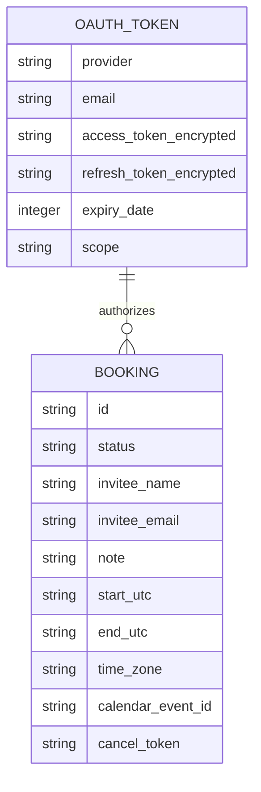
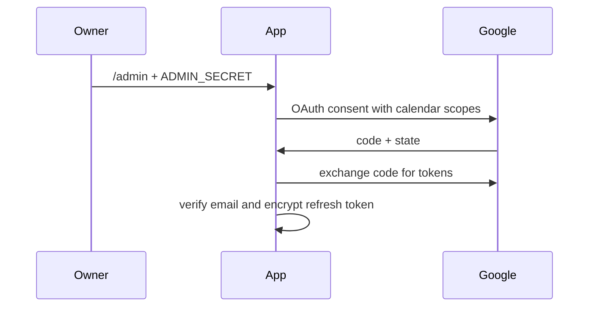
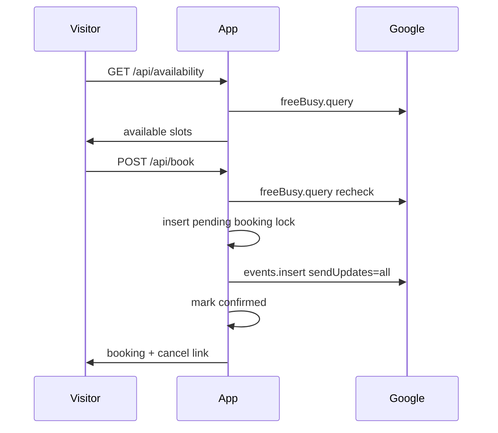

# OpenMeet — Architecture

## Open Source Reconnaissance

| # | Repo | Fit | Adoption |
|---|------|-----|----------|
| 1 | `calcom/cal.diy` | 3/5 | Reference only; too broad for a personal single-owner scheduler. |
| 2 | `thunderbird/appointment` | 3/5 | Reference only; product-grade architecture is heavier than needed. |
| 3 | `alextselegidis/easyappointments` | 2/5 | Skip; useful conceptually but PHP/business scheduling oriented. |

Decision: build independently, borrowing the key pattern of treating calendar busy data as the authoritative availability source.

## Tech Stack

| Layer | Choice | Rationale |
|-------|--------|-----------|
| Frontend | Next.js App Router + React | One project for UI and API; easy local/Railway deploy. |
| Backend | Next.js route handlers | Small API surface and no separate service process. |
| Database | SQLite via Node `node:sqlite` | Personal app, no native npm sqlite dependency, simple lock table. |
| Auth | Google OAuth for owner only | Visitors do not need accounts. |
| Calendar | Google Calendar API | `freeBusy.query` for slots, `events.insert/delete` for lifecycle. |
| Deployment | Local first, Railway-compatible | Persistent disk required for SQLite. |

## Data Model

## API Design

| Method | Path | Purpose |
|--------|------|---------|
| GET | `/api/availability` | Return slot groups for a viewer timezone. |
| POST | `/api/book` | Validate slot, lock it, create Google event. |
| POST | `/api/cancel` | Cancel local booking and delete Google event. |
| GET | `/api/admin/google/start` | Start protected owner OAuth. |
| GET | `/api/admin/google/callback` | Store encrypted owner tokens. |
| GET | `/api/health` | Report setup and token status. |

## Auth Flow

## Booking Flow

## Architecture Layers

| Path | Layer | Rule |
|------|-------|------|
| `package.json`, `next.config.ts`, `tsconfig.json` | L0 | Skeleton; change with ADR. |
| `contracts/` | L0 | Public API/types contract. |
| `src/lib/db.ts`, `src/lib/google.ts`, `src/lib/scheduler.ts` | L1 | Shared infra/business logic. |
| `src/app/api/*` | L2 | Thin transport adapters. |
| `src/features/booking/*` | L2 | UI feature implementation. |
| `src/app/*` pages | L2 | Routing and presentation. |

## Deployment

Required env vars:

- `APP_BASE_URL`
- `OWNER_EMAIL`
- `GOOGLE_CALENDAR_ID`
- `GOOGLE_CLIENT_ID`
- `GOOGLE_CLIENT_SECRET`
- `TOKEN_ENCRYPTION_KEY`
- `ADMIN_SECRET`

Railway needs a persistent volume mounted for `data/openmeet.db`.

## Key Decisions

See `docs/adr/`.
